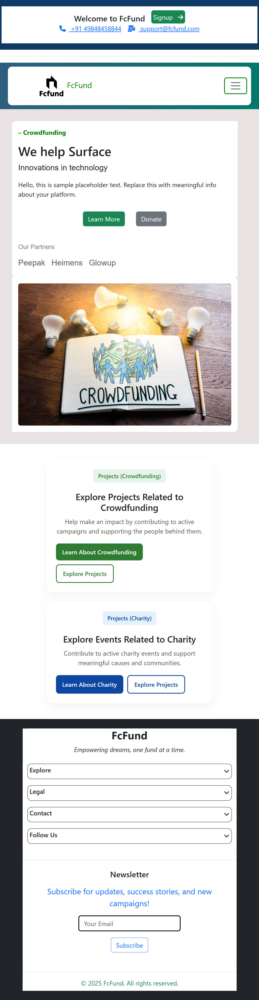
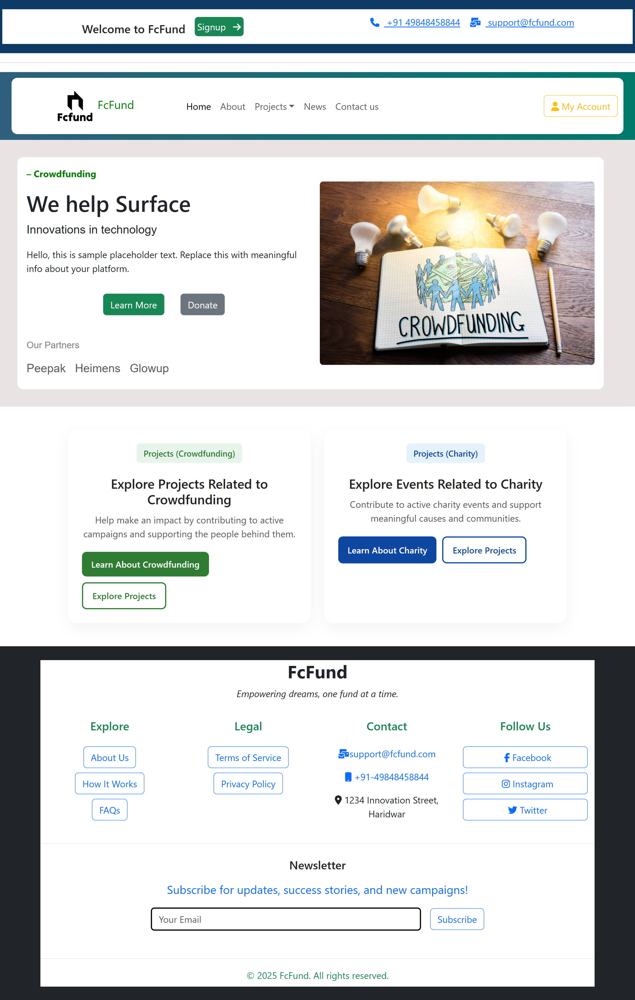
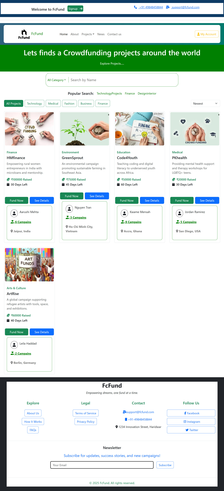

# Fc Fund (Crowdfunding & Charity Website)
A modern, responsive Crowdfunding & Charity Platform built using React.js. This platform enables individuals and organizations to create fundraising campaigns and allows donors to support causes they care about.

## Screenshots(mobile)

## Screenshots(desktop)

## Features
- Campaign Creation: Users can create, edit, and manage crowdfunding campaigns.

- Donation System: Secure donation flow with progress tracking.

- Responsive Design: Optimized for mobile, tablet, and desktop devices.

- Campaign Listings: Browse, search, and filter active campaigns.

- React Hooks & Functional Components

- Modern UI/UX using styled-components or CSS modules (customizable)

- SEO-friendly Metadata Setup with React Helmet

## Tech Stack
- React.js	
     - Front-end library
- React Router	
     - Routing and navigation
- Styled Components / CSS Modules
     - Styling and layout

- Bootstrap
    - Responsive layout & UI components

## Responsive Design
- Built using mobile-first principles. Supports:

     - Smartphones

     - Tablets

    - Desktop monitors

- Try resizing the browser window or opening it on different devices to experience the layout changes.

## Future Features
- User authentication (OAuth / Firebase)

- Admin dashboard

- Social sharing integration

- Comment or feedback section

- Campaign approval workflow

- Payment gateway (Stripe or PayPal)

-  Backend API (Node.js / Firebase / Express)

-   Data Storage (MongoDB (mongoose.js)	 / MySQL / PostgreSQL	 )

## Get started Guide
- npm start in terminal

## Contributing
Contributions are welcome!

- bash
- Copy
- Edit
- git checkout -b feature/YourFeature
- git commit -m "Add your feature"
- git push origin feature/YourFeature
- Then open a pull request 

## License
- This project is licensed under the MIT License.

## Available Scripts
In the project directory, you can run:

npm start       # Runs the app in development mode
npm run build   # Builds the app for production
npm test        # Launches the test runner